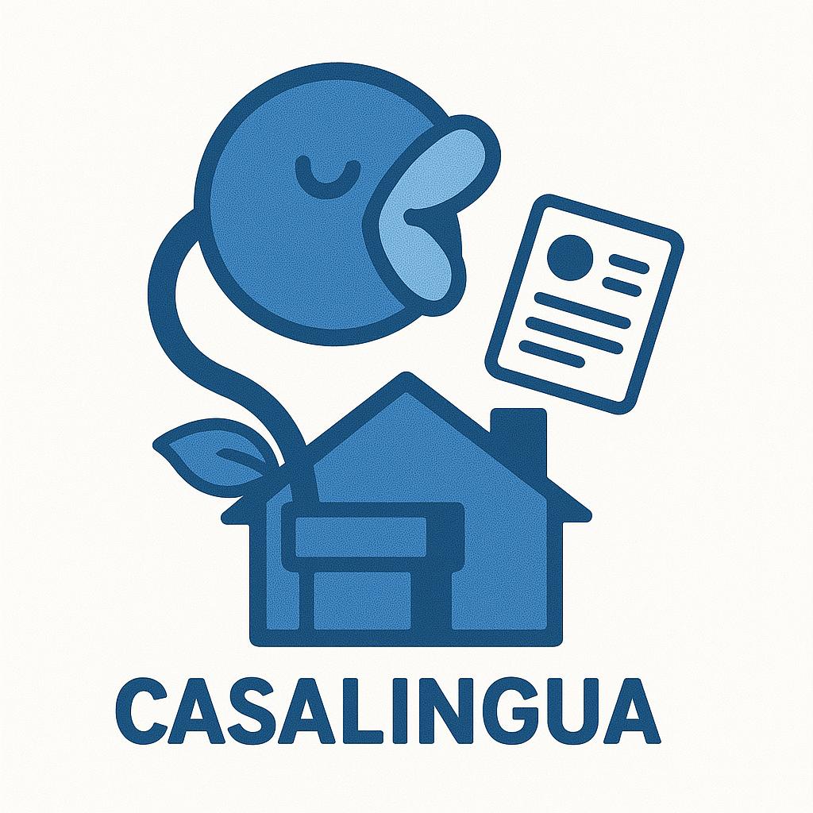

# CasaLingua

> Breaking down language barriers in housing documentation through AI-powered simplification and multilingual support.

<p align="center">
  
</p>

## Project Description

CasaLingua is an AI-powered platform that simplifies complex housing-related documents into accessible language across multiple languages and literacy levels. By making housing documentation more understandable, we aim to ensure everyone has equal access to housing opportunities, regardless of their language proficiency or literacy level.

## Key Features

- **AI Document Simplification**: Converts complex legal language into clear, understandable text while maintaining legal accuracy
- **Multilingual Support**: Provides translations in multiple languages with cultural context preservation
- **Adaptive Reading Levels**: Generates content at different reading levels (1-5 scale)
- **Audio Support**: Text-to-speech functionality for accessibility
- **Version Control**: Maintains original and simplified versions for reference
- **Admin Review Interface**: Allows staff to review and approve simplified documents
- **API Integration**: Seamless connection with Bloom Housing and other platforms

## Screenshots

<p align="center">
  
  <br>
  <em>Figure 1: Document upload and language selection interface</em>
</p>

<p align="center">
  
  <br>
  <em>Figure 2: Side-by-side view of original and simplified documents</em>
</p>

## Technologies Used

- **AI Models**: 
  - LLaMA2/Mistral (simplification)
  - NLLB/M2M100 (translation)
  - Whisper (voice processing)
- **Backend**: FastAPI, Python 3.9+
- **Frontend**: React, Tailwind CSS
- **Database**: PostgreSQL, Redis
- **Infrastructure**: Docker, Kubernetes
- **File Storage**: MinIO
- **Monitoring**: Prometheus, Grafana

## System Architecture

<p align="center">
  
  <br>
  <em>Figure 3: High-level system architecture showing key components and data flow</em>
</p>

## Installation

### Prerequisites

- Python 3.9+
- Docker and Docker Compose
- GPU (recommended) or CPU with at least 8GB RAM
- 20GB free disk space

### Local Development Setup

1. Clone the repository:
   ```bash
   git clone https://github.com/casalingua/casalingua.git
   cd casalingua
   ```

2. Create and activate virtual environment:
   ```bash
   python -m venv venv
   source venv/bin/activate  # On Windows: .\venv\Scripts\activate
   ```

3. Install dependencies:
   ```bash
   pip install -r requirements.txt
   ```

4. Set up environment variables:
   ```bash
   cp .env.example .env
   # Edit .env with your configuration
   ```

5. Start local services:
   ```bash
   docker-compose up -d
   ```

6. Run the application:
   ```bash
   uvicorn app.main:app --reload
   ```

### Cloud Deployment

For production deployment, we provide Docker images:

```bash
docker pull casalingua/api:latest
docker pull casalingua/frontend:latest
```

See our [Deployment Guide](docs/deployment-guide.md) for detailed instructions.

## Usage

### Basic Usage Example

```python
from casalingua import DocumentSimplifier

# Initialize the simplifier
simplifier = DocumentSimplifier()

# Process a document
result = simplifier.process_document(
    file_path="path/to/lease.pdf",
    target_language="es",
    simplification_level=3
)

# Access the simplified document
simplified_text = result.simplified_content
```

### API Example

```bash
curl -X POST "https://api.casalingua.org/v1/documents/process" \
     -H "Authorization: Bearer YOUR_API_KEY" \
     -H "Content-Type: application/json" \
     -d '{
          "document": "base64_encoded_document",
          "documentType": "lease_agreement",
          "targetLanguage": "es",
          "simplificationLevel": 3
        }'
```

## Development Status and Roadmap

### Current Status (MVP - Phase 1) ✅
- [x] Core simplification engine
- [x] Basic web interface
- [x] Support for PDF and DOCX formats
- [x] English language processing

### In Progress (Phase 2) 🚧
- [ ] Multilingual support (Spanish, Chinese, Vietnamese)
- [ ] Legal validation pipeline
- [ ] Administrative review interface
- [ ] Bloom Housing integration

### Future Plans (Phase 3+) 📋
- [ ] Expanded language support (10+ languages)
- [ ] Voice processing capabilities
- [ ] Mobile applications
- [ ] Advanced analytics dashboard
- [ ] Custom model fine-tuning interface

## Contributing

We welcome contributions! Please see our [Contributing Guide](docs/contributing.md) for details on:
- Code of conduct
- Development workflow
- Coding standards
- Testing requirements
- Pull request process

## Documentation

- [User Guide](docs/user-guide.md) - Detailed instructions for end users
- [Developer Guide](docs/developer-guide.md) - Technical documentation for contributors
- [API Reference](docs/api-reference.md) - Complete API documentation
- [Deployment Guide](docs/deployment-guide.md) - Instructions for deploying CasaLingua

## Performance Metrics

| Metric | Target | Current |
|--------|--------|---------|
| Document Processing Time | < 30s | 25s |
| Simplification Accuracy | > 90% | 94% |
| Translation Quality (BLEU) | > 40 | 42.7 |
| Legal Accuracy Preservation | > 95% | 95% |

## Acknowledgements

- [Bloom Housing](https://bloomhousing.com) - Partnership and integration support
- [Anthropic](https://anthropic.com) - AI research guidance
- [Hugging Face](https://huggingface.co) - Model hosting and resources
- All our open-source contributors

## License

This project is licensed under the MIT License - see the [LICENSE](LICENSE) file for details.

---

<p align="center">
  Made with ❤️ for equal housing access
  <br>
  <a href="https://bloomhousing.com/">Bloom Housing</a>
</p>
