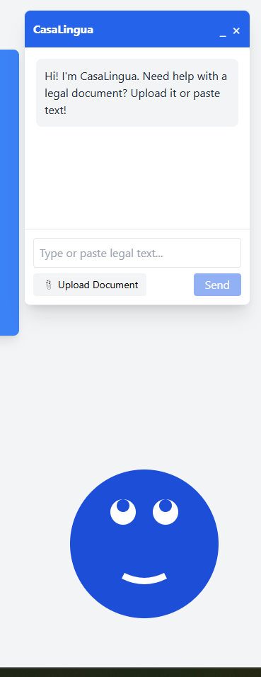
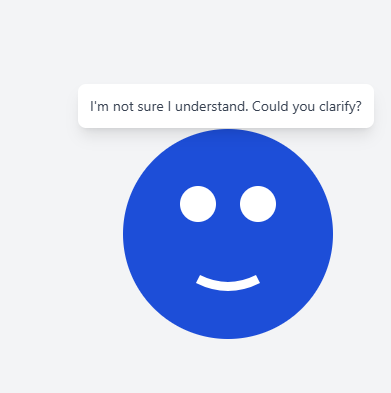

# CasaLingua User Guide

Welcome to CasaLingua! This guide will help you understand how to use our platform to simplify housing documents and make them accessible in multiple languages.

## Table of Contents

1. [Getting Started](#getting-started)
2. [Document Processing](#document-processing)
3. [Language Options](#language-options)
4. [Simplification Levels](#simplification-levels)
5. [Review and Approval](#review-and-approval)
6. [Accessibility Features](#accessibility-features)
7. [Troubleshooting](#troubleshooting)

## Getting Started

### Account Types

CasaLingua supports two main user types:

1. **Housing Seekers**: Individuals looking to understand housing documents
2. **Housing Staff**: Professionals who upload and manage documents

### First-Time Setup

1. Visit [https://app.casalingua.org](https://app.casalingua.org)
2. Click "Create Account" or "Sign In"
3. Choose your user type
4. Complete your profile

## Document Processing

### Uploading Documents

  
   
  <em>Figure 1: How to upload a document</em>

1. Click the "Upload Document" button
2. Select your file (PDF, DOCX, or TXT)
3. Choose the document type from the dropdown
4. Click "Process Document"

### Supported Document Types

- Housing Applications
- Lease Agreements  
- Housing Policies
- Tenant Rights Documents
- Fair Housing Documents

## Language Options

### Available Languages

CasaLingua currently supports:

- English
- Spanish
- Chinese (Simplified)
- Vietnamese
- Tagalog
- More languages coming soon!

### Selecting a Language

1. After uploading a document, choose your preferred language
2. The system will automatically translate and simplify the content
3. You can switch languages at any time during your session

## Simplification Levels

Our platform offers 5 reading levels:

| Level | Description | Reading Age | Example |
|-------|-------------|-------------|---------|
| 1 | Basic | Grade 4-5 | Simple words, short sentences |
| 2 | Easy | Grade 6-7 | Common vocabulary, longer sentences |
| 3 | Standard | Grade 8-9 | General audience, some complexity |
| 4 | Advanced | Grade 10-12 | Technical terms with explanations |
| 5 | Professional | College-level | Minimal simplification, focused clarity |

### Choosing a Level

  
   
  <em>Figure 2: Reading level selection interface</em>

Use the slider to select your preferred reading level. The system will preview the first paragraph at your chosen level.

## Review and Approval

### For Housing Staff

1. **Review Simplified Documents**:
   - Compare original and simplified versions side-by-side
   - Highlight changes and simplifications
   - Check for legal accuracy

2. **Edit and Approve**:
   - Make manual adjustments if needed
   - Add notes or explanations
   - Mark document as approved

### For Housing Seekers

- View approved documents in your language
- Download simplified versions
- Provide feedback on clarity

## Accessibility Features

### Text-to-Speech

1. Click the speaker icon on any document
2. Select language and voice
3. Use playback controls to pause, resume, or change speed

### High Contrast Mode

- Toggle high contrast mode in settings
- Adjustable font sizes
- Dyslexia-friendly font options

### Keyboard Navigation

All features are accessible using keyboard shortcuts:
- `Tab`: Navigate between elements
- `Enter`: Select/activate
- `Escape`: Close dialogs
- `Space`: Play/pause audio

## Troubleshooting

### Common Issues

1. **Document Fails to Upload**
   - Check file format (must be PDF, DOCX, or TXT)
   - Ensure file is less than 10MB
   - Try a different browser

2. **Simplification Takes Too Long**
   - Check your internet connection
   - Large documents may take up to 60 seconds
   - Try processing during off-peak hours

3. **Translation Appears Incorrect**
   - Report the issue using the feedback button
   - Try a different simplification level
   - Contact support for manual review

### Getting Help

- Click the help icon (?) in the top right
- Email support@casalingua.org
- Call our helpline: 1-800-CASA-LNG

## Tips for Best Results

1. **Clean Documents**: Ensure scanned documents are clear and text is readable
2. **Right Format**: Convert images to PDF with OCR before uploading
3. **Be Specific**: Choose the correct document type for better results
4. **Provide Feedback**: Help us improve by sharing your experience

---

  Need additional help? Visit our <a href="https://support.casalingua.org">Support Center</a>

