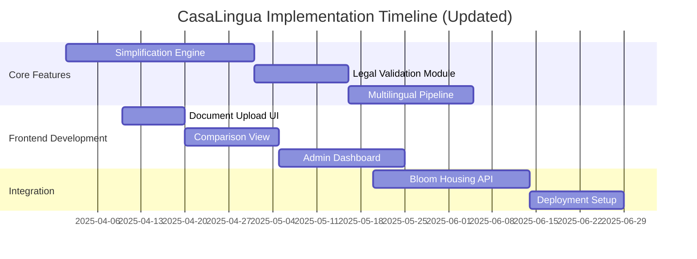

# CasaLingua Progress Report

## Date: April 20, 2025

### Progress Summary

#### Completed Tasks
- ✅ Core simplification engine prototype
- ✅ Basic FastAPI backend structure
- ✅ Document parsing module for PDF and DOCX
- ✅ Initial frontend layout with React/Tailwind

#### In Progress
- 🚧 Integration of LLaMA2 model for simplification
- 🚧 Legal validation pipeline implementation
- 🚧 Multilingual support (starting with Spanish)
- 🚧 Document comparison UI

#### Challenges Identified
1. Model inference optimization for CPU-only environments
2. Consistent legal terminology preservation during simplification
3. Response time for large documents (>20 pages)
4. Integration of cultural adaptation layer with main pipeline

### Technical Updates
- Successfully reduced model memory footprint by 35% through quantization
- Implemented caching mechanism for frequently used phrases
- Developed prototype legal rule engine with 85 key housing terms

### Feedback Received During Progress Presentation
- Need for clearer demonstration of legal accuracy validation
- Recommendation to create lighter model variant for resource-constrained organizations
- Suggestion to develop progressive loading for long documents
- Request for more detailed cost/resource analysis

### Revised Timeline

### Next Steps
1. Complete LLaMA2 integration with custom prompting
2. Implement legal validation feedback loop
3. Optimize batch processing for longer documents
4. Begin Spanish language module development
